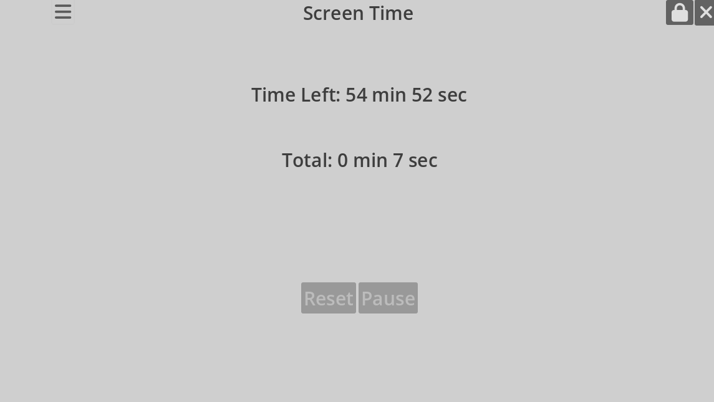

# Screen time app
To keep track of pause time.  
To close apps when parant control is active after set time.

## Attribute
### Sound from freesound.org
<a href="https://freesound.org/people/Thoribass/sounds/253595/">notification1-freesound.wav</a> by <a href="https://freesound.org/people/Thoribass/">Thoribass</a> | License: <a href="https://creativecommons.org/licenses/by/4.0/">Attribution 4.0</a>

# settings store

Plats för user://
Linux: ~/.local/share/godot/app_userdata/<project_name>/
Linux dev: ~/.var/app/org.godotengine.Godot/data/godot/app_userdata
Windows: %APPDATA%\Godot\app_userdata\<project_name>\
macOS: ~/Library/Application Support/Godot/app_userdata/<project_name>/

# Overview

# Refs
pop up window
https://www.youtube.com/watch?v=qo8SDCuVCoY

